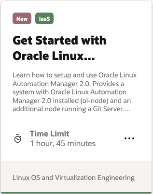
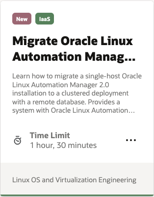
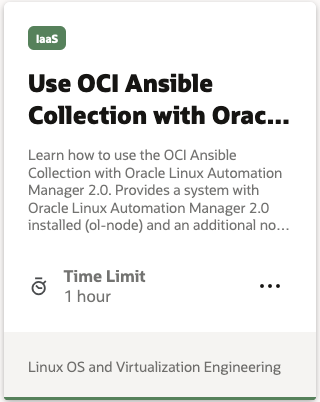
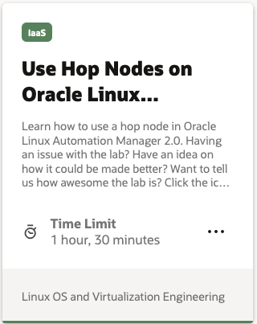
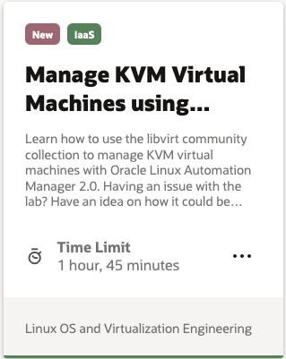
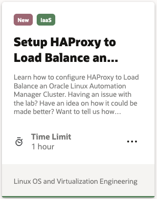
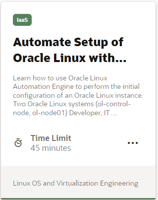
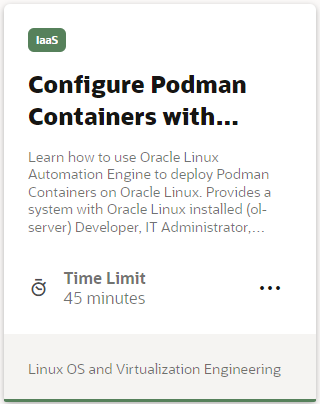

# Welcome to Oracle Linux Automation Manager Track

---
This track provides free training to help introduce you to Oracle Linux Automation Manager and improve your skills with its automation tools.

The Oracle Linux Automation Engine is an automation tool for deploying software, configuring systems, and orchestrating tasks such as upgrades and updates, in the form of playbooks.

Oracle Linux Automation Manager provides features that allow your organization to effectively manage infrastructure configuration through a browser user interface. Using Oracle Linux Automation Manager you can:
- Create and configure permissions for organizations, users, and teams that use Oracle Linux Automation Manager
- Create projects that import Oracle Linux Automation Engine playbooks from various sources, such as a local machine or from a remote git repository
- Create an inventory which specifies the hosts where playbook tasks run
- Create job templates that specify the projects and playbooks to run
- Manually launch or schedule the launch of job templates

---

### Oracle Linux Automation Manager Videos

### Oracle Linux Automation Manager Hands On Labs

Practice your skills with Oracle Linux Automation Manager with these free hands on labs.

<a href="https://youtu.be/HOB5dhbcAyo">Click here to learn about using the free hands on labs</a>

 

 
 

---

### Working with Oracle Linux Automation Manager Engine Hands On Labs

Practice your skills with Oracle Linux Automation Manager Engine with these free hands on labs.

<a href="https://youtu.be/HOB5dhbcAyo">Click here to learn about using the free hands on labs</a>

 

 
 

---

### Installing Oracle Linux Automation Manager Videos

These videos will get you started with the installation and overview of Oracle Linux Automation Manager version 1.0.

### Administering Oracle Linux Automation Manager Videos

Learn how to add users, organizations, credentials, and permissions to prepare for running jobs with Oracle Linux Automation Manager version 1.0.

 
 

### Resources

Following page provides additional product information:

- [Oracle Linux Automation Manager Documentation](https://docs.oracle.com/en/operating-systems/oracle-linux-automation-manager/)
- [Oracle Linux Automation Manager Training YouTube Playlist](https://www.youtube.com/playlist?list=PLKCk3OyNwIzsGuAWaMCiVrNCdU-2Y0ujg)

---

#### [Return to Oracle Linux Training Station](../README.md)
