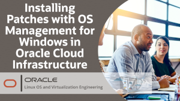
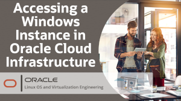
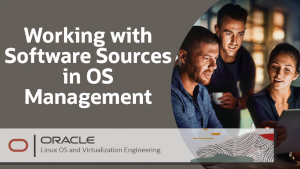
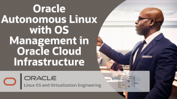
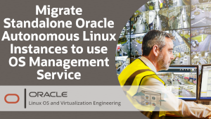
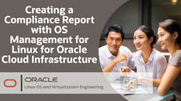
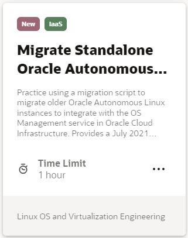
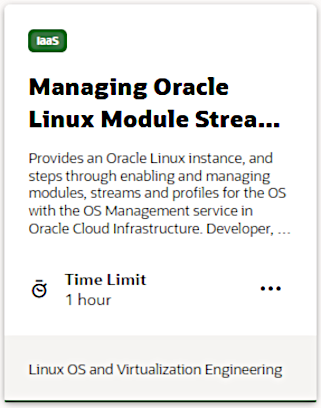

# Welcome to OS Management on Oracle Cloud Infrastructure Track

---
Oracle Cloud Infrastructure OS Management allows you to manage updates and patches for the operating system environment on your private data center and Oracle Cloud Infrastructure instances.

On these pages, you will find videos, documents, and other useful resources relating to:

- Oracle OS Management Hub
- Oracle OS Management Service

---

Oracle OS Management Hub is used to manage and monitor updates and patches for the operating system environments in private data centers through a single management console. It simplifies the provisioning and maintaining of large deployments of physical servers and virtual machines that span public cloud and private data centers.

<h3 style="color:red;">Training videos and resources will be Coming Soon! Check back regularly for updates.</h3>

---

The Oracle Cloud Infrastructure OS Management service allows you to manage updates and patches for the operating system environment on your Oracle Cloud Infrastructure instances. OS Management also provides options for discovering and monitoring resources on your instances.

On these pages, you will find videos, documents, and other useful resources on topics such as:
- Getting Started with OS Management
- Installing and Patching a Windows instance
- Checking the status of the Oracle Cloud Agent

### Installation
One of the first requirements to use the OS Management Service is to have a running instance of Linux or Windows.

### Working with the Oracle OS Management Service Videos
These videos will provide information to get started and work with the OS Management Service on Linux and Windows instances.

### Working with the Oracle OS Management Service Hands On Lab

### Resources

Following page provides additional product information:

- [OS Management Documentation](https://docs.oracle.com/en-us/iaas/os-management/home.htm)

#### [Return to Oracle Linux Training Station](../README.md)
